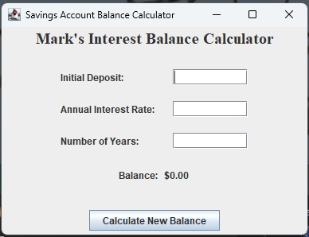

# Savings Account Balance Calculator

This is a simple Java application that calculates the final balance of a savings account after a given number of years, based on an initial deposit and an annual interest rate. The application uses a graphical user interface (GUI) built with Swing.

## Features

- Input fields for the initial deposit, annual interest rate, and number of years.
- A button to calculate the new balance.
- Displays the calculated balance.

## Screenshot



## Prerequisites

- Java Development Kit (JDK) 8 or higher

## How to Run

1. Clone the repository:
    ```sh
    git clone https://github.com/Mark-Langston/Interest_Balance_Calculator.git
    cd Interest_Balance_Calculator
    ```

2. Compile the Java files:
    ```sh
    javac Main.java
    ```

3. Run the application:
    ```sh
    java Main
    ```

## Code Explanation

### Main.java

The `Main` class creates and displays the GUI. It includes:

- Labels and text fields for the initial deposit, annual interest rate, and number of years.
- A button to trigger the calculation.
- Labels to display the final balance.

### BankAccount.java

The `BankAccount` class handles the calculation of the final balance based on the provided initial deposit, annual interest rate, and number of years.

## Usage

1. Enter the initial deposit amount in the "Initial Deposit" field.
2. Enter the annual interest rate (in percentage) in the "Annual Interest Rate" field.
3. Enter the number of years in the "Number of Years" field.
4. Click the "Calculate New Balance" button.
5. The calculated balance will be displayed.

## Contributing

1. Fork the repository.
2. Create a new branch (`git checkout -b feature-branch`).
3. Make your changes.
4. Commit your changes (`git commit -am 'Add new feature'`).
5. Push to the branch (`git push origin feature-branch`).
6. Create a new Pull Request.
